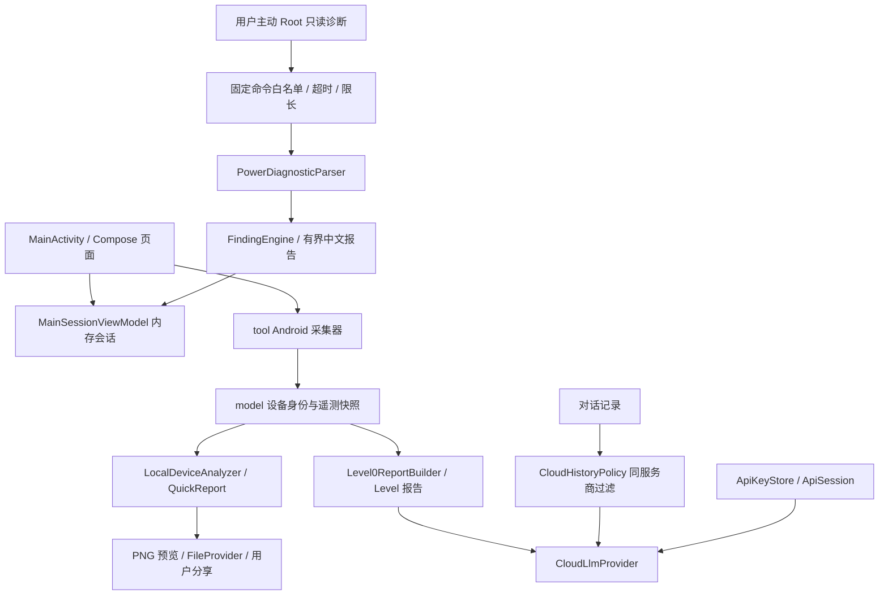

# APA 架构与审计范围

审计日期：2026-09-09。对象：`codex/scene-battery-report` 工作分支，以 `5828920` 为起点并保留此前未提交的键盘修复。审计对象是源码及本地构建，不是已发布 APK 的安全认证。

## 当前结构

单 Gradle `app` 模块，Kotlin + Compose。暂不引入多模块、数据库或依赖注入框架。

## 模块责任

| 区域 | 当前责任 | 边界与问题 |
| --- | --- | --- |
| `model/` | DeviceIdentifiers、DeviceIdentity、DeviceInfo、DeviceSnapshot、基础遥测 DTO、SampleTime | 不依赖 Android、UI 或采集器；原始标识与展示名分离 |
| `tool/` | Android API、Usage Events、固定白名单只读 shell、耗电解析、离线名称库适配 | 单源超时/失败不阻断整份诊断；不提供任意命令入口 |
| `agent/` | 本地规则、报告文字、云端协议、凭据、历史策略 | 纯规则可 JVM 测试；网络 JSON 与 HTTP 尚未分离 |
| `MainActivity.kt` | 导航、Compose 状态、刷新和请求编排、多个页面、部分报告组装 | 仍过大；会话状态已提取，采集/请求用例仍在 Activity，不声称分层已彻底完成 |
| `MainSessionViewModel.kt` | 草稿、报告选择、对话、结构化耗电诊断、已读快照/档案；请求代次和中断状态 | 不保存原始 Root 输出、凭据或 Activity；不是磁盘会话持久化 |
| `QuickReportPanel.kt` | 本地卡片渲染、预览和显式分享 | Provider 只开放 cache/report-cards；缓存清理与 Android 实测待补 |
| Gradle/Manifest | 版本、变体、签名边界、权限及导出组件 | Debug 独立包名；签名校验放到 Release 打包任务 |

## 数据与信任边界

1. 首次进入和 Activity 恢复时自动在本机刷新普通设备数据，包括可见应用及可选 Usage Access 汇总。不是“只有选报告才读取”。
2. 点击发送后重新采集基础快照。Root 电池/档案必须主动读取，带各自时间，不是同步快照。
3. 无有效配置时使用本地规则；有 Key 时主动请求所选服务商。应用目前没有任意命令执行工具链，模型只返回文字。
4. 系统耗电诊断必须由用户点击启动；只读 Root 输出在内存中限长解析后释放。诊断摘要默认不发送，明确勾选后才进入本次请求。
5. 同服务商最多保留最近 12 条允许发送的历史消息。先过滤后截取。之前的云端回答仍可能包含之前的数据，发送新消息不等于撤回此前传输；清空对话可阻止后续携带历史。
6. 云端 HTTP 层只向配置端点发送，凭据由本机 Keystore 解密。不测试真实 API、不读取或记录用户 Key。服务商错误正文不读取/展示，任意异常正文不透出；成功响应经 CloudResponseReader 限为 1 MiB 并严格解码。网络可取消性与完整协议测试仍有技术债。
7. 分享先预览再由用户选择目标应用；当前仅分享生成的 PNG，不授予整个缓存目录的外部访问权限。

## 审计覆盖

已检查全部生产源文件与现有测试入口，覆盖：设备/屏幕/电池/RAM/存储、应用/Root 检测、UsageEvents、Root 采集与 parser、Scene、报告/本地分析、云端请求与历史、凭据期限/加密/备份、全部 Compose 页面及主题、PNG 分享、Manifest、Gradle/版本/签名、README/历史计划。

采用源码追踪、异常输入回归、JVM 测试、Android Lint、Debug 与 androidTest 编译及签名缺失负向构建；独立只读审查补充生命周期、包可见性与发布流程问题。结果与未覆盖范围见 [TESTING](TESTING.md)。未做依赖漏洞数据库扫描、渗透测试、设备系统审计或外部服务协议认证。

## 架构决策

- **渐进提取**：本轮把基础领域模型从 Android 采集器移出；保留公开页面行为。页面状态已提取到 ViewModel，SaveableStateHolder 按页面保留轻量展示状态；下一步提取用例层，避免同时重写所有页面。
- **事实与推断分开**：原始机型标识不替换成商品名；名称来源不是硬件真实性证明；未获取读数不填零。
- **默认本地历史**：新消息未标记云端服务商时，不能成为请求历史。服务商归属字段是边界，不能靠匹配“Scene”等正文关键字来过滤。
- **不滥设外部 schema**：当前 DTO 仅用于内存，尚无持久化 JSON API。未来导出/存储要显式引入 schemaVersion 和迁移，不能直接序列化 Compose 状态或格式化报告文字。

技术债、优先级和验收条件见 [TECH_DEBT](TECH_DEBT.md)，产品交付顺序见 [ROADMAP](../ROADMAP.md)。
