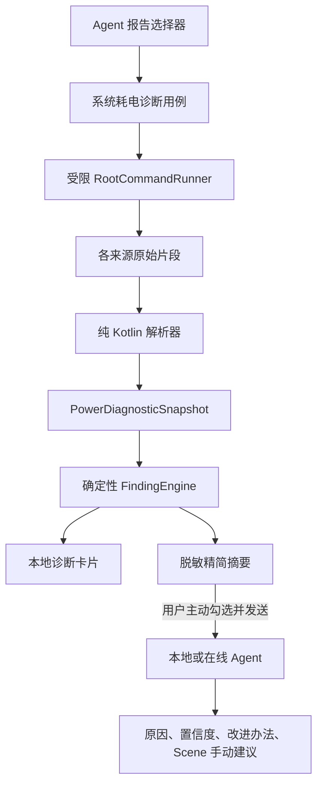

# 系统耗电诊断与 Scene 建议设计

日期：2026-09-11  
目标分支：`codex/system-power-diagnostics`  
基线：`codex/scene-battery-report` 的 `e8856ab`

## 背景

现有 Scene CSV 能汇总电量、温度、电流、功耗和前台应用，但它不能可靠解释后台唤醒、定时任务、Job、Doze、内核唤醒源或系统温控，也不能把这些机器数据转成普通用户可执行的建议。用户希望以系统级、只读的耗电诊断替换现有 Scene 报告入口，再由 Agent 用人话说明证据，并给出需要用户手动执行的 Scene 冻结、后台限制或性能限制建议。

本设计建立在现有 Scene 报告分支上，保留其会话、安全、云端历史和响应大小加固，不从旧的 `main` 占位版本重新实现。

## 目标

- 用 Root 只读采集与耗电定位直接相关的系统状态。
- 将 UID、包名、计数器、时长和系统状态解析为结构化事实。
- 本地生成普通用户可理解且能追溯到原始证据的诊断卡片。
- 让用户显式选择后，把精简诊断摘要交给本地或在线 Agent。
- Agent 提供观察、限制、冻结候选三级建议，并说明在 Scene 中手动处理的方向和副作用。
- 对权限拒绝、厂商差异、缺失命令、超时和超大输出进行部分成功降级。

## 非目标

- 不自动冻结、强停、卸载、限频、修改 Doze 白名单或写入任何系统节点。
- 不执行 `dumpsys batterystats --reset`，不清除用户或系统统计。
- 不自动触发 `*#*#284#*#*`，也不在首版生成或解析完整 Bug Report。
- 不承诺通过一次快照准确计算某应用独占的 mAh、电池寿命或必须更换电池。
- 不深度链接或控制 Scene；不同 Scene 版本的具体按钮文字可能不同。
- 不将原始日志、设备唯一标识或未筛选的系统错误正文发送给模型。

## 方案选择

采用“定向采集 + 确定性解析 + Agent 解释”的方案。

完整 `284` Bug Report 信息更全，但生成慢、体积大、含有大量与耗电无关或敏感的数据；仅打开拨号暗码又无法形成 APA 可消费的结构化结果。首版只采集耗电诊断所需子集，并把每个来源、权限和缺失状态保留下来。完整 Bug Report 可在以后作为独立的高级导入功能评估。

## 架构

### 组件边界

- `SystemPowerDiagnosticsCollector`：编排采集项、超时、输出上限和部分成功；不解析业务含义。
- `RootCommandRunner`：从现有 Root 工具中提取受限的只读执行能力，只接受代码中预定义的命令，不接受模型或用户提供的任意命令字符串。
- 独立解析器：每种输出一个纯 Kotlin 解析器，返回事实或带原因的缺失状态；解析器不生成 UI 文案。
- `PowerDiagnosticFindingEngine`：根据结构化事实生成证据、影响、置信度、限制条件和建议等级；不调用 Android API。
- `PowerDiagnosticReportBuilder`：生成本地预览和发给 Agent 的精简摘要；原始输出不进入提示词。
- `MainSessionViewModel`：保存当前会话的采集状态、结构化结果和勾选状态；不持有 `Activity`、Root 进程或原始大文本。
- `MainActivity` / Compose：触发采集、展示进度与卡片、展开有限的原始证据、复制包名和选择是否随问题发送。

## 采集范围

首版按独立采集项运行；任一项失败不取消其他项。

| 来源 | 用途 | 首版边界 |
| --- | --- | --- |
| `dumpsys batterystats` | UID 活动、唤醒锁、网络、传感器及系统电量历史线索 | 只读，不 reset；解析已确认字段，未知格式保留为不支持 |
| `dumpsys power` | 交互、休眠、唤醒和保持唤醒状态 | 只报告采样时事实，不把瞬时状态扩展成全天结论 |
| `dumpsys alarm` | 频繁定时唤醒 | 计数与时间窗同时可用时才比较频率 |
| `dumpsys jobscheduler` | 待执行和频繁后台 Job | 区分系统 UID 与第三方包，不将存在 Job 等同异常 |
| `dumpsys deviceidle` | Doze 状态及白名单线索 | 只解释状态，不修改白名单 |
| `dumpsys thermalservice` | 温控状态和降频线索 | 区分电池、SoC、机身温度；传感器缺失不填零 |
| `/sys/kernel/debug/wakeup_sources` 等只读节点 | 内核或驱动唤醒源 | 仅在设备提供且 Root 可读时采集；不可用时明确缺失 |
| `cmd package list packages -U` 与 PackageManager | UID、包名和应用显示名映射 | 多包共享 UID 时全部保留，不武断归因给单一应用 |

每项使用独立超时和字符/字节上限。采集结果记录开始、结束、来源、成功/缺失/超时/截断状态。超限内容只保留解析所需片段和截断标记，不把系统错误全文展示或上传。

## 数据模型

核心模型放在 `model/`，使用明确单位、可空值和状态枚举：

- `PowerDiagnosticSnapshot`：采样时间、采集时长、各来源状态、结构化事实集合。
- `DiagnosticSourceStatus`：`AVAILABLE`、`UNSUPPORTED`、`PERMISSION_DENIED`、`TIMED_OUT`、`TRUNCATED`、`PARSE_FAILED`。
- `AppPowerEvidence`：UID、包名集合、显示名、唤醒锁时长、Alarm/Job/网络/传感器等可用事实。
- `SystemPowerEvidence`：交互/休眠状态、Doze、温控和内核唤醒源事实。
- `PowerFinding`：稳定 ID、类别、标题、证据列表、通俗解释、置信度、建议等级、Scene 建议和限制说明。
- `AdviceLevel`：`OBSERVE`、`RESTRICT`、`FREEZE_CANDIDATE`。

未知值用 `null` 或显式状态表示；0 只表示来源明确报告为 0。时长统一为毫秒，电流/电压/温度沿用项目现有明确单位约定。模型不依赖 Context、Compose、Root 或网络。

## 诊断与翻译规则

每条卡片固定回答：发现了什么、证据是什么、可能影响、置信度、建议、Scene 手动处理方向和副作用。

示例：

> 微信可能频繁唤醒系统。统计窗口内记录到 186 次相关唤醒，用户态唤醒锁累计 24 分钟。它可能增加熄屏待机耗电，但这些计数不能证明全部电量由微信独占。建议先在 Scene 限制后台活动并保留通知，观察下一轮结果；完全冻结可能导致消息延迟。

规则要求：

- 不只按单个绝对数值下结论；优先结合同一窗口内的相对排名、持续时间和多个来源交叉验证。
- 阈值使用命名常量并在测试中固定；输出必须显示触发结论的数值和窗口。
- 共享 UID、多包映射、截断、缺失窗口或厂商格式不明确时降低置信度。
- 系统关键包、桌面、电话、短信、支付相关包和 Root 管理器只解释，不生成冻结候选。
- Scene 建议使用“观察”“限制后台/唤醒/性能”“冻结候选”等版本中立描述，并提供包名复制；不伪造未经验证的菜单路径。
- Agent 提示策略要求区分事实、推断和建议，不得声称 APA 或 Scene 已执行操作。

## 用户界面与数据流

1. Agent 的“选择报告”用“系统耗电诊断”替换现有 Scene CSV 入口和会话状态。
2. 用户点击“采集诊断”后看到 Root 授权、当前采集项和总体进度。
3. 完成后显示采样时间、覆盖范围、来源完整度、高风险应用和系统异常卡片。
4. 卡片可展开有限原始证据并复制包名；不展示整段原始日志。
5. 默认不附带报告。用户勾选“系统耗电诊断”并发送问题时，才构建脱敏摘要。
6. 无 API Key 时本地规则仍显示事实和基础建议；有 Key 时 Agent 在相同证据上补充解释，但不能越过提示策略。
7. 当前会话跨页面和 Activity 配置重建保留结构化结果；进程死亡后不恢复。首版不新增数据库或长期日志档案。

现有 Scene CSV 的选择器、会话字段、提示词参数、文档和专用 UI 测试将被系统耗电诊断替换。确认无其他调用后删除不再可达的 Scene 解析代码和样例，避免保留两套相互矛盾的报告语义。

## 隐私与安全

- 采集必须由用户点击触发；不在启动、刷新设备页或发送普通问题时隐式执行 Root 命令。
- Root 命令是代码内白名单，不接受模型输出、远端内容或任意用户文本拼接。
- 不采集或上传 IMEI、序列号、Android ID、账户、短信内容、通知内容、精确位置或完整 logcat。
- 本地预览只保留结构化事实和有限证据。原始命令输出在解析后释放；若因诊断失败需保留，也只能存于应用私有临时目录并有大小上限，不参与备份与分享。
- 在线请求只携带用户选中的精简摘要；对话历史沿用同服务商过滤和条数上限。
- UI 和提示词明确说明包名、使用模式与系统时间信息会在用户勾选发送后传给所选模型服务商。

## 错误处理

- Root 不可用或授权被拒绝：停止 Root 采集，保留普通电池快照，并给出一次性可操作说明；不重复弹授权。
- 单项命令不存在、权限不足、超时或解析失败：标记对应来源，继续其他来源，最终报告显示完整度。
- 所有来源均失败：不生成空报告，不允许勾选发送，展示失败分类而非原始 stderr。
- Activity 重建：取消仍在运行的采集并标记“已中断，可手动重试”，不自动再次执行 Root 命令。
- 在线模型失败：保留本地诊断结果；错误信息沿用现有脱敏与响应大小策略。
- 数据不足：输出“证据不足”和下一轮应如何采样，不将缺失解释为正常。

## 测试与验收

### JVM 单元测试

- 为每个解析器提供脱敏的小米实测夹具，以及未知厂商、空输出、格式变化、共享 UID、异常数字和截断夹具。
- 验证时间和单位转换、UID/包名映射、缺失语义及部分成功合并。
- 验证 FindingEngine 的阈值边界、置信度降级、系统包保护和建议等级。
- 验证 ReportBuilder 不包含原始大段日志、唯一标识、未选报告或失败正文。
- 验证提示策略要求引用证据，并禁止声称已冻结、强停、限频或修改系统。

### Android 与集成测试

- Root 授权成功、拒绝、中断和 Activity 重建。
- 采集进度、部分结果、展开证据、复制包名、勾选/移除和跨页面会话状态。
- 本地模式与在线模式的附件边界；未勾选时请求不得包含诊断摘要。
- 检查执行命令白名单，明确断言不存在 `reset`、`force-stop`、冻结、卸载、白名单修改或写系统节点。
- 在连接的 Root 小米设备上验证各来源可用性、超时、输出上限、Debug 构建和实机 UI；不把单机可用性声称为全机型兼容。

### 完成标准

- “Scene 报告”已由“系统耗电诊断”替换，无不可达的旧会话或提示词路径。
- 一次点击能得到可读的本地部分或完整报告；失败项不拖垮成功项。
- 每条建议可追溯到数值证据，并包含置信度和副作用。
- 用户未主动勾选并发送时，没有诊断数据离开设备。
- 全部 JVM 测试、Lint、Debug 构建和 androidTest 编译通过；Root 小米实机流程有记录。

## 分支与交付

功能在 `codex/system-power-diagnostics` 独立工作树实现。先提交本设计和实现计划，再按测试驱动顺序实现模型/解析器、采集器、规则与报告、会话/Agent 集成、Compose UI、旧 Scene 清理和文档更新。最终是否合并由用户在完整验证后决定。
